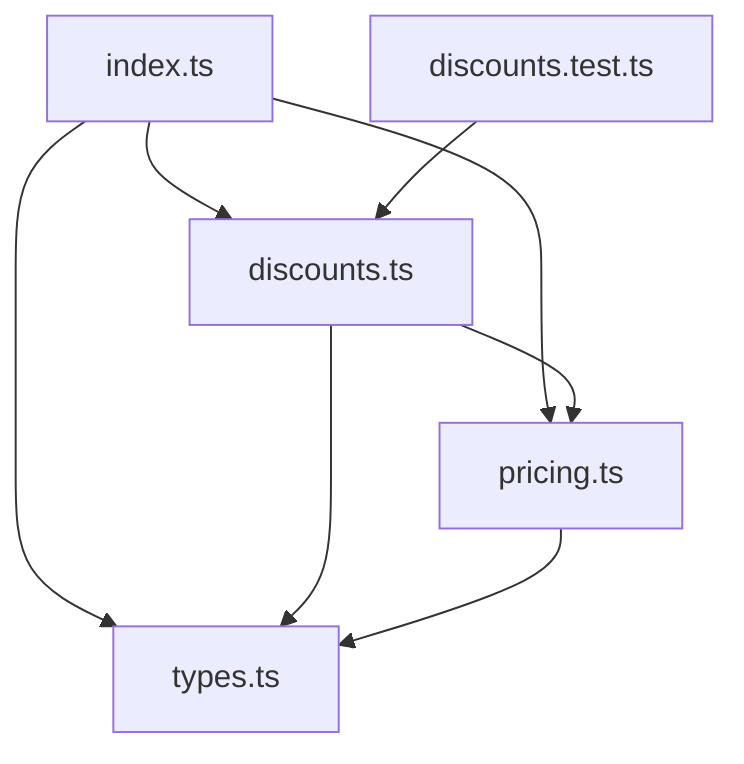

# Architecture Spine — Checkout Discounts — Tier + Coupon Engine

## Design Paradigm

Functional core: one pure exported function, `applyDiscounts`, that folds a fixed step
sequence — the tier discount, then each `order.coupons` entry in array order — over a
**local, non-exported accumulator** (`{ buckets, claimedCategories, seenCodes,
outcomes }`). No classes, no module-level state, no I/O, no thrown exceptions for
business outcomes. This is `pricing.ts`'s existing `(order) => value` style, extended
with two more read-only inputs (`coupons`, `asOf`) and a richer return value — not a
new architectural style.

The single most important call this spine makes: **validation and application are one
interleaved pass, not two phases.** The PRD's FR-2 prose ("validated independently
before any discount math runs") reads as two phases, but FR-3's proportional-split rule
(reads each bucket's *current* share) and FR-4's `category_claimed` rule (depends on
whether an earlier code was already *applied*) both require state from every prior
coupon's actual application. AD-1 below is the resolution: process `order.coupons`
left-to-right once; each entry's checks read the accumulator as left by strictly
earlier entries, and a passing entry updates the accumulator immediately, in place,
before the next entry is checked.



Arrows read "depends on." `discounts.ts` reuses `subtotalKopecks`, `shippingKopecks`,
`tierPercent` from `pricing.ts` rather than recomputing them — no duplicate money math.

## Invariants & Rules

### AD-1 — Single-pass, interleaved validate-and-apply

- **Binds:** FR-2, FR-3, FR-4
- **Prevents:** two builders each honoring FR-2, FR-3 and FR-4 literally but
  incompatibly — one running a true two-phase "validate all, then apply all" (which
  cannot produce a correct proportional split or `category_claimed` result), the other
  interleaving state as it goes. These produce different totals and different
  rejection reasons on the same order.
- **Rule:** iterate `order.coupons` by index, left to right, after the tier step has
  run once against freshly-initialized buckets. For entry `i`, evaluate its checks
  (AD-2 through AD-5, FR-2's precedence order) against the accumulator as left by
  entries `0..i-1` only. If entry `i` passes every check, reduce the bucket(s) it
  targets and update `claimedCategories`/`seenCodes` **before** entry `i+1` is
  evaluated. "Validated independently" in FR-2 means "not merged/summed with other
  codes," not "computed from a frozen pre-loop snapshot."

### AD-2 — `category_claimed` excludes self-claims

- **Binds:** FR-4, FR-2's precedence order, epics.md Story 2.3
- **Prevents:** a repeated category-scoped code (same normalized code entered twice)
  being reported `category_claimed` (because its own earlier occurrence already
  claimed the category) instead of `duplicate` — which would contradict Story 2.3's
  explicit requirement, and would also make `duplicate` unreachable for any
  category-scoped coupon.
- **Rule:** `category_claimed` fires only when the target bucket's category was
  already claimed by an earlier **applied** coupon whose normalized code **differs**
  from this entry's normalized code. A self-claim (same normalized code) is not a
  `category_claimed` case; it falls through to the `duplicate` check.

### AD-3 — `too_many_codes` is check #0, position-based

- **Binds:** FR-2a, FR-2's precedence order, epics.md Story 2.4
- **Prevents:** one builder capping on raw array position, another capping on the
  count of distinct/deduplicated codes — these disagree the moment an order's
  `coupons` array contains a duplicate before index 10 (position-based: the 11th raw
  entry is capped regardless; distinct-based: a duplicate before position 10 would
  "buy" one more real slot). FR-2's own six-step precedence list never says where this
  check fits, and FR-2a's "distinct valid-looking codes" phrasing conflicts with its
  own "11th and later entered codes" phrasing.
- **Rule:** for the entry at 0-based index `i` in `order.coupons`, if `i >= 10`, its
  outcome is `{ applied: false, reason: "too_many_codes" }` immediately — no catalog,
  expiry, or other check runs for it. Only entries at index `< 10` proceed to FR-2's
  six-step precedence (`not_found` → `expired` → `min_not_met` → `no_matching_items`
  → `category_claimed` → `duplicate`).

### AD-4 — Duplicate tracking scope

- **Binds:** FR-2 (`duplicate`), Story 2.3
- **Prevents:** tracking "seen" codes only when a code is actually applied, which
  would let the same unresolvable typo be entered three times and get `not_found` on
  every occurrence with no `duplicate` ever reported — a defensible-looking but wrong
  reading, since it silently drops the "you typed this twice" signal for invalid
  codes.
- **Rule:** `seenCodes` accumulates the normalized (trim + lowercase) form of every
  entry at index `< 10`, applied or rejected, immediately after that entry is
  resolved. `duplicate` for entry `i` fires only after `not_found`/`expired`/
  `min_not_met`/`no_matching_items`/`category_claimed` have all been checked and
  passed, per FR-2's stated order.

### AD-5 — Catalog lookup: first match, no uniqueness check

- **Binds:** FR-2 (code resolution)
- **Prevents:** one builder throwing/erroring on a catalog containing two `Coupon`
  records with the same code (case-insensitively), another silently picking the last
  match — divergent behavior on malformed catalog input that the PRD puts out of
  scope alongside other `Coupon` well-formedness concerns.
- **Rule:** resolve a typed code via `coupons.find(c => normalize(c.code) ===
  normalize(typed))` — first array match wins. Catalog code-uniqueness is not
  validated by this engine (same "assumed guaranteed upstream" scope as percent-range
  and non-negative-fixed-value checks, PRD FR-2 Out of Scope).

### AD-6 — File layout

- **Binds:** all FRs
- **Prevents:** new result/reason types leaking into `types.ts` (breaks the frozen
  contract in PRD §5 / AGENTS.md) or a multi-file module split that two builders
  would draw differently (e.g. one putting `RejectionReason` in `types.ts` "since it's
  a type", another in a new `errors.ts`).
- **Rule:** all new code — `RejectionReason`, `CouponOutcome`, `DiscountResult`,
  `applyDiscounts`, and any private helpers — lives in one new file,
  `app/src/discounts.ts`, mirroring `pricing.ts`'s single-file, no-subfolder pattern.
  Its only test file is `app/src/discounts.test.ts`. `app/src/types.ts` is not edited.
  `app/src/index.ts` gets additive re-exports of `applyDiscounts` and the three new
  types — no re-exports removed or changed.

### AD-7 — Engine signature; no internal clock, no default `asOf`

- **Binds:** FR-5, NFR2
- **Prevents:** an implicit `Date.now()` read inside the "pure" engine (makes expiry
  tests flaky/order-dependent), or a default parameter value on `asOf` that lets a
  caller silently get non-deterministic behavior by omission.
- **Rule:** `export function applyDiscounts(order: Order, coupons: Coupon[], asOf:
  Date): DiscountResult`. `asOf` is **required**, no default on this function. Any
  `new Date()` default is the caller's responsibility (e.g. a thin wrapper in
  `index.ts` or a checkout handler), per Story 1.2 AC2's explicit requirement that the
  default lives "only at the outer call site... never inside the pure pricing
  function."

### AD-8 — Category bucket representation

- **Binds:** FR-3, NFR1
- **Prevents:** `noUncheckedIndexedAccess: true` (already on in `app/tsconfig.json`)
  forcing scattered non-null assertions or silent optional-chaining no-ops at every
  bucket read/write, which two builders would resolve differently (one asserting
  everywhere, one accidentally swallowing an update behind `?.`).
- **Rule:** buckets are `Partial<Record<LineItem["category"], number>>`, with exactly
  one key per category **present in `order.items`** (per FR-3 — no bucket for an
  absent category). All keys are seeded before the tier step runs and no step ever
  deletes a key, so every read after initialization is non-undefined by construction.
  Route every read through one private accessor (e.g. `getBucket(state, category)`)
  that asserts this once, rather than asserting ad hoc at each call site.

### AD-9 — Rounding primitive

- **Binds:** FR-3 (rounding), NFR1
- **Prevents:** reaching for a decimal/bignum dependency (forbidden — AGENTS.md: no
  new runtime dependencies) or hand-rolling a half-up rounder that defends against
  negative inputs that cannot occur on this path.
- **Rule:** round every per-step discount amount (a bucket's percent reduction, a
  bucket's share of a proportional fixed split) with `Math.round()`, once, at the
  point it's computed. This is safe because every value rounded here is non-negative
  by construction (buckets and `Coupon.value` are never negative before the
  post-reduction floor), and `Math.round()`'s toward-`+Infinity` tie-break coincides
  with "half up" for all non-negative inputs.

### AD-10 — Outcome list shape

- **Binds:** FR-6, epics.md Story 4.1
- **Prevents:** a synthetic "tier" entry leaking into the outcomes array (breaks
  Story 4.1's "exactly two outcome entries" count for a Gold + 1 applied + 1 expired
  order), or a rejected outcome reporting `discountKopecks: 0` instead of omitting the
  field (breaks the optional-field contract FR-6 states).
- **Rule:** `DiscountResult.coupons` has exactly one entry per string in
  `order.coupons`, in entry order — the tier discount is never an entry in this list,
  only reflected in the aggregate totals. An applied entry carries `discountKopecks`
  (the total kopecks that entry removed, summed across every bucket it touched) and
  omits `reason`. A rejected entry carries `reason` and omits `discountKopecks`
  (`undefined`, not `0`).

## Consistency Conventions

| Concern | Convention |
| --- | --- |
| Naming (entities, files, interfaces, events) | `normalizeCode(code) = code.trim().toLowerCase()`, used for catalog match, `seenCodes`, and claim-owner comparison — never for display. Category tie-break order is literal ascending string order (`digital < fresh < standard`), which is JS's default `Array.sort()` behavior — no custom comparator needed. |
| Data & formats (ids, dates, error shapes, envelopes) | `RejectionReason = "not_found" \| "expired" \| "min_not_met" \| "no_matching_items" \| "category_claimed" \| "duplicate" \| "too_many_codes"`. `CouponOutcome = { code: string; applied: boolean; discountKopecks?: number; reason?: RejectionReason }` — `code` echoes the **original as-typed** string from `order.coupons` (untrimmed, original case), not the normalized form, so a caller can match each outcome back to exactly what the customer entered. `DiscountResult = { itemsTotalKopecks: number; shippingKopecks: number; grandTotalKopecks: number; coupons: CouponOutcome[] }`. |
| State & cross-cutting (mutation, errors, logging, config, auth) | `applyDiscounts` never mutates its `order` or `coupons` parameters. No logging/console output. No thrown exceptions for business-rule rejections — every rejection is a `CouponOutcome` in the return value; exceptions (if any) are reserved for truly unreachable/programmer-error states, never for an expected validation outcome. |

## Stack

Brownfield, no new stack — reused as pinned in `app/package.json`.

| Name | Version |
| --- | --- |
| TypeScript | ^5.6.0 |
| Node (types / runtime) | @types/node ^22.10.0, Node 22+ |
| vitest | ^2.1.0 |

## Structural Seed

```text
app/
  src/
    types.ts           # UNCHANGED — Order, LineItem, Coupon
    pricing.ts          # UNCHANGED — lineTotalKopecks, subtotalKopecks, shippingKopecks, tierPercent
    discounts.ts         # NEW — RejectionReason, CouponOutcome, DiscountResult, applyDiscounts()
    discounts.test.ts    # NEW — one test per PRD "Consequences" / epics.md AC bullet
    index.ts             # ADDITIVE re-exports of applyDiscounts + the 3 new types
```

## Deferred

- **Max-codes cap tuning (10) and any per-merchant override** — PRD §6.2 fixes this
  as a constant, not a configuration surface; out of scope for this altitude and for
  MVP entirely (PRD Open Question #1).
- **Coupon catalog storage/issuance** — `coupons: Coupon[]` is accepted as a plain
  parameter; where it's persisted, fetched, or authored is explicitly out of scope
  (brief, PRD Non-Goals) and not this spine's concern.
- **Checkout UI / receipt itemization of `DiscountResult`** — FR-6's shape is the
  hand-off point; rendering it is a future UX spec (PRD Open Question #2).
- **Any wrapper that supplies `new Date()` at a real call site** (e.g. inside
  `index.ts` or an HTTP handler) — this spine fixes that the *pure engine* must not
  default it (AD-7), but building that outer call site is not part of this feature's
  in-scope surface per the PRD/epics (no HTTP layer exists in `app/`).
